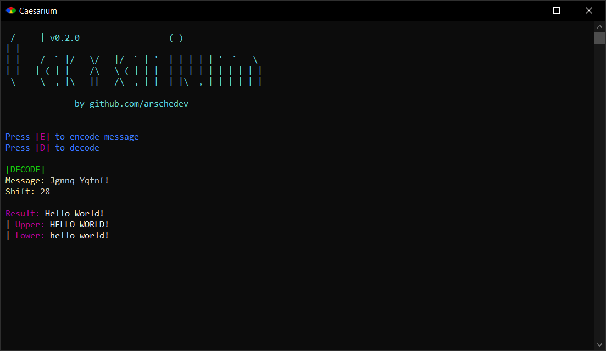

# Caesarium
#### Caesar cipher encoder / decoder



---

###### Installation
1. Download [Ruby](https://www.ruby-lang.org)
1. [Download project directory](https://downgit.evecalm.com/#/home?url=https://github.com/arschedev/arschedev/tree/main/Projects/Ruby/Caesarium)
1. Open project directory
1. Run `bundle install` in your terminal

###### CLI
```
ruby main.rb
```

###### Command Line Arguments
```
ruby main.rb <message> <shift>
```

- Shift "Hello World!" by 2

```
> ruby main.rb "Hello World!" 2
Jgnnq Yqtnf!
```

- Decoding

```
> ruby main.rb "Jgnnq Yqtnf!" -2
Hello World!
```